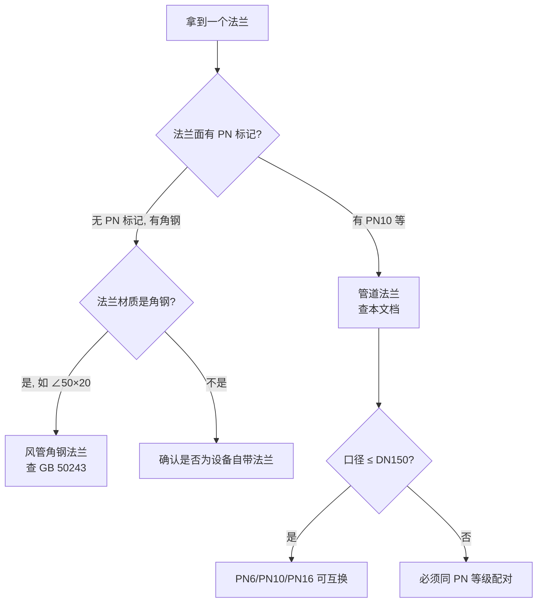

# 管道法兰 PN 系列国标速查

> [!abstract] 一句话概述
> 管道法兰（PN 系列）是管道连接的工业标准，与暖通风管法兰（角钢弯制）是**两套完全不同的体系**，互不通用。

---

## 一、核心概念

| 术语 | 全称 | 含义 | 单位 |
|------|------|------|:---:|
| **DN** | Diameter Nominal | 公称直径，法兰/管道的通径标号 | mm |
| **PN** | Pressure Nominal | 公称压力，法兰能承受的最大工作压力 | bar |

> [!tip] 一句话理解
> **DN450 PN10** = 通径 450mm 的管道法兰，能扛 10 公斤（1.0 MPa）压力。

---

## 二、PN 压力等级系列

国标 GB/T 9112-2010 定义的 PN 系列共 **9 个等级**：

| 等级 | 压力值 | 俗称 |
|:----:|:------:|------|
| PN2.5 | 2.5 bar | 2.5 公斤 |
| PN6 | 6 bar | 6 公斤 |
| PN10 | 10 bar | 10 公斤 |
| PN16 | 16 bar | 16 公斤 |
| PN25 | 25 bar | 25 公斤 |
| PN40 | 40 bar | 40 公斤 |
| PN63 | 63 bar | 63 公斤 |
| PN100 | 100 bar | 100 公斤 |
| PN160 | 160 bar | 160 公斤 |

> [!warning] 注意
> 国标 PN 系列**没有 PN5**。行业里说的"5 公斤法兰"实际对应 **PN6**（6 bar ≈ 0.6 MPa）。PN 等级从 PN2.5 直接跳到 PN6，中间没有 PN5。

---

## 三、不同 PN 等级的法兰能否互联？

### 3.1 核心规则

| 口径范围 | PN6 ↔ PN10 | PN10 ↔ PN16 | 原因 |
|----------|:----------:|:----------:|------|
| **DN15 ~ DN150** | ✅ 可互换 | ✅ 可互换 | 小口径法兰各 PN 等级尺寸相同 |
| **DN200 及以上** | ❌ 不能 | ❌ 不能 | 螺栓孔中心圆直径不同、孔数不同、螺栓规格不同 |

> [!important] 关键
> **DN150 是分水岭**。从 DN200 开始，不同压力等级的法兰尺寸开始分化，不能再互换。

### 3.2 DN450 实际对比（EN 1092-1 标准）

以 DN450 为例，PN6 和 PN10 的差异一目了然：

| 参数 | PN6 | PN10 | 差多少 |
|------|:---:|:---:|:---:|
| 法兰外径 | 595 mm | **615 mm** | +20 mm |
| 螺栓孔中心圆 | 550 mm | **565 mm** | +15 mm |
| 螺栓孔直径 | 22 mm | 26 mm | +4 mm |
| 螺栓规格 | M20 | **M24** | 差一级 |
| 螺栓数量 | **16** 个 | **20** 个 | +4 个 |
| 法兰厚度 | 30 mm | 36 mm | +6 mm |

**结论：四个关键尺寸全都不一样，螺栓根本穿不进去。**

---

## 四、相关国标一览

| 标准编号 | 名称 | 说明 |
|----------|------|------|
| **GB/T 9112-2010** | 钢制管法兰 类型与参数 | PN 系列总纲，定义压力等级和公称尺寸范围 |
| **GB/T 9119-2010** | 板式平焊钢制管法兰 | 最常用的 PN 系列法兰尺寸表（PN2.5~PN100） |
| GB/T 9113-2010 | 整体钢制管法兰 | — |
| GB/T 9114-2010 | 带颈螺纹钢制管法兰 | — |
| GB/T 9115-2010 | 对焊钢制管法兰 | — |

> [!tip] 欧标等价标准
> EN 1092-1 与 GB/T 9112 系列尺寸基本一致，都是欧洲体系。美标用 Class 系列（Class150/300/600），换算公式：MPa ≈ 0.007 × Class。

---

## 五、管道法兰 vs 风管法兰——千万别搞混

| 对比维度 | 管道法兰（PN 系列） | 风管法兰（暖通） |
|----------|-------------------|-----------------|
| **用途** | 水管/气管/油管连接 | 通风管道连接 |
| **标准** | GB/T 9112~9124 | GB 50243 / JGJ 141 |
| **材质** | 钢板冲压/锻造 | 角钢/扁钢弯制 |
| **密封** | 法兰垫片（橡胶/金属） | 密封胶条或无须密封 |
| **压力** | 有压力等级（PN2.5~PN160） | 低压/中压/高压（风管系统压力） |
| **关键尺寸** | 螺栓孔中心圆 + 孔数 + 螺栓规格 | 外径 + 孔位中心直径 + 孔数 |
| **是否可互换** | 同 PN 同 DN 可互换 | 厂内标准，不同厂不一定对得上 |

---

## 六、实战速查

---

## 相关笔记

- [GB50243-2016 通风与空调工程施工质量验收规范](/knowledge/pipe-fitting-spec/GB50243-2016-通风与空调工程施工质量验收规范/)|GB 50243-2016 — 风管法兰材料规格（表 4.2.6-1）
- JGJ141-2017 通风管道技术规程|JGJ 141-2017 — 风管连接方式（角钢法兰/共板法兰/插接）
- [A.06 矩形法兰口八大类速查](/knowledge/pipe-fitting-spec/A-06-矩形法兰口八大类速查/) — 风管法兰口分类速查表
